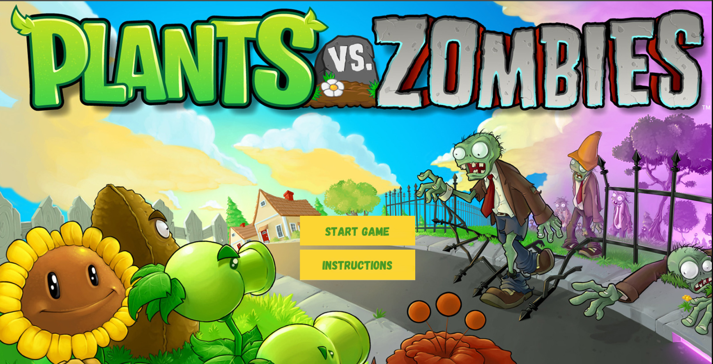
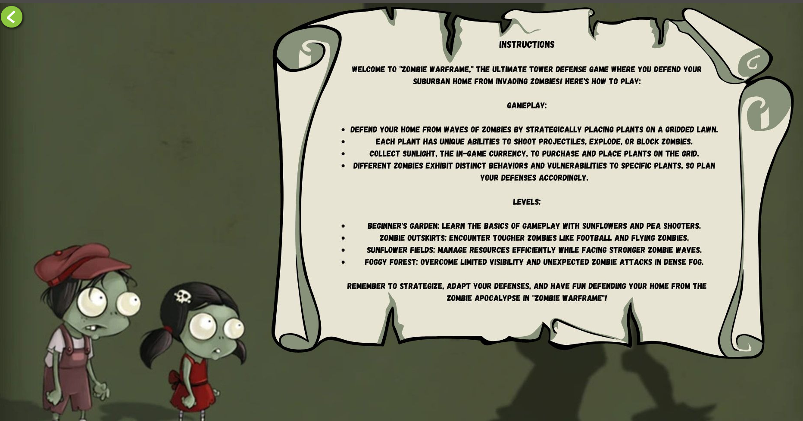
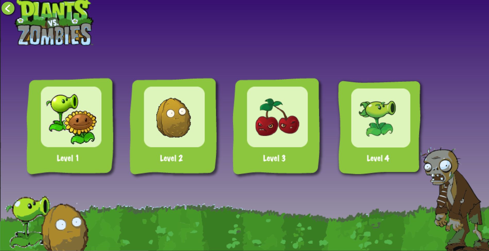
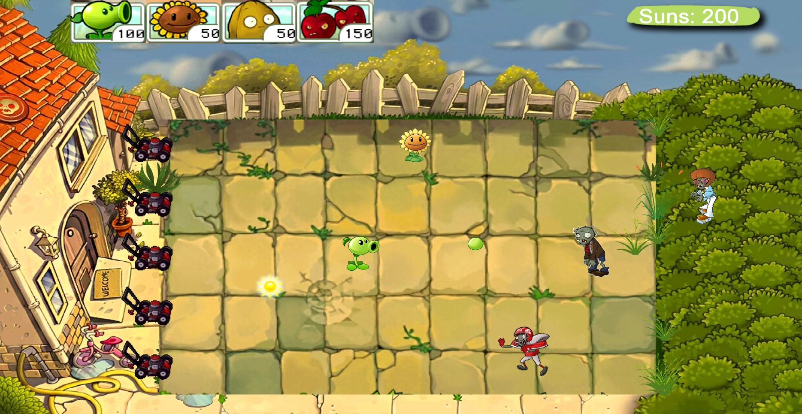
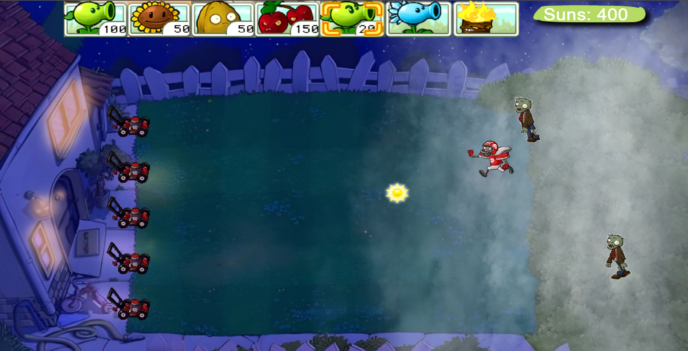

# Plants-Vs-Zombies

This is a clone of the popular **Plants vs Zombies** game, developed using **C++** and the **Simple and Fast Multimedia Library (SFML)**. The game features an engaging defense system where players must use various plants to defend their garden from waves of zombies.

## Features

- Developed in **C++** using **SFML** for graphics and multimedia.
- Multiple levels with increasing difficulty.
- Variety of plant and zombie types, each with unique abilities and characteristics.
- Strategic gameplay requiring careful plant placement and resource management.

# Zombies:

## 1. SimpleZombie
   - A basic zombie that walks across the screen in a straightforward path.
## 2. FootballZombie
   - A zombie wearing a football uniform with increased speed and health.
## 3. BackupDancer
   -A special zombie that appears alongside a DancingZombie.
## 4. DancingZombie
   - A zombie that dances while moving across the screen.
## 5. FlyingZombie
   - **Description**: A zombie that flies above the ground.

## Start screen

## Instructions

## Gameplay and Levels

The game consists of **four levels**, each introducing new challenges, plant types, and zombies. The objective is to defend your garden from approaching zombies by planting different types of plants that have unique abilities.

### Level 1: Beginner's Garden

- **Available Plants:**
  - **Sunflower:** Generates sun points to plant other plants.
  - **Peashooter:** Shoots peas to damage zombies.

### Level 2: Zombie Outskirts

- **Available Plants:**
  - **Sunflower**
  - **Peashooter**
  - **Wall-nut**
  - **Cherry Bomb:** Deals area damage to multiple zombies.
  

### Level 3: Sunflower field

- **Available Plants:**
  - **Sunflower**
  - **Peashooter**
  - **Wall-nut**
  - **Snow Pea**
  - **Cherry Bomb**
  - **Repeater:** Shoots two peas at once.
  - **Snow Pea:** Shoots ice peas.

### Level 4: Foggy Forest
(This level isn't fully functional)

- **Available Plants:**
 - **Sunflower**
  - **Peashooter**
  - **Wall-nut**
  - **Snow Pea**
  - **Cherry Bomb**
  - **Repeater**
  - **Snow Pea:**
  - **Torch Wood:**

## Controls

- **Mouse:** Click to plant plants in your garden.
